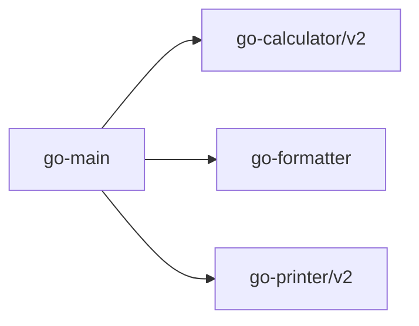

# chatgpt4generated-go-main

chatGPT4 generated _go-main_ module

Brings all the dependencies together "github.com/litesoft-go/":

1. chatgpt4generated-_go-calculator_
2. chatgpt4generated-_go-formatter_
3. chatgpt4generated-_go-printer_

part of the multi-module example

Dependencies:
